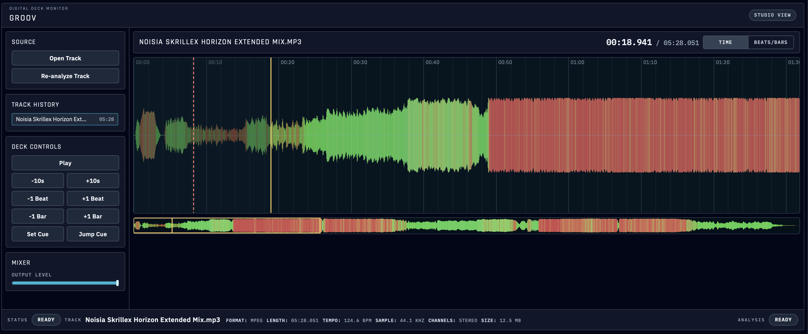

# Groov



Groov is a desktop audio deck monitor built with Electrobun + React.  
Load a track, inspect a high-resolution waveform, detect tempo/beat grid, and jump around quickly with DJ-style transport controls.

## Features

- Open tracks from file picker or drag-and-drop
- Waveform rendering with detailed main view + minimap overview
- Tempo and beat/bar detection (BPM + beat offset)
- Time and beat/bar timeline modes
- Fast navigation controls:
  - Play/pause
  - +/- 10s
  - +/- 1 beat
  - +/- 1 bar
  - Cue set/jump
- Track history with quick reload and removal
- Waveform analysis caching for faster re-opens
- Re-analyze current track on demand

## Prerequisites

- [Bun](https://bun.sh/)
- `ffmpeg` and `ffprobe` available on your `PATH` (required for waveform and beat analysis)

## Development

```bash
bun install

# Development with HMR (recommended)
bun run dev:hmr

# Development without HMR
bun run dev
```

When using HMR, Vite runs on `http://localhost:5173` and the desktop app connects to it automatically.

## Build

```bash
# Build app
bun run build

# Build production channel
bun run build:prod
```

## Keyboard Shortcuts

- `Space`: play/pause
- `Left` / `Right`: seek -/+ 1 second
- `Shift + Left` / `Shift + Right`: seek -/+ 10 seconds
- `C`: set cue point

## Project Structure

```text
src/
  bun/         # Main process, RPC handlers, analysis/cache/history
  mainview/    # React UI (panels, waveform canvas, playback controls)
  shared/      # Shared RPC types and assets
```
